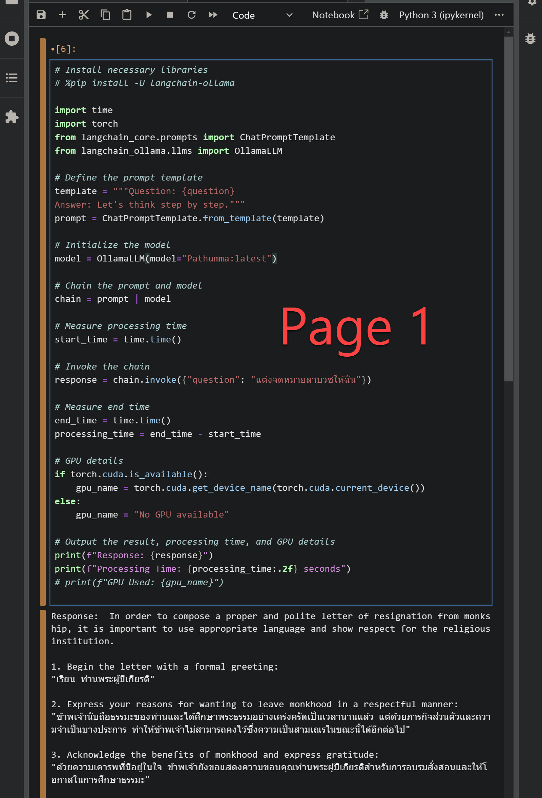

# Jupyter Lab Server with Docker

## อ่านเพิ่มเติม
[อ่านบทความเพิ่มเติมที่นี่](https://medium.com/p/0059745f7df5/edit)

---

## วิธีการรัน

1. เปลี่ยนไดเรกทอรีไปยังโฟลเดอร์โปรเจกต์:
   ```bash
   cd "/data/miniconda_docker7705"
   ```

2. เรียกใช้งาน Docker Compose: (ตั้งเวลา kernel ที่ 60 วินาที แล้วจะ kill แต่ยังมีปัญหา ตีกันกับ ollama อยู่)
   ```bash
   sudo docker-compose up -d
   ```

---

## การอัปเดตใหม่หลังหยุดการทำงาน

- ใช้คำสั่งต่อไปนี้เพื่ออัปเดต:
  ```bash
  sudo docker-compose up -d
  ```

- หากต้องการสร้าง `temp image` ใหม่โดยไม่ใช้แคช:
  ```bash
  sudo docker-compose build --no-cache
  ```

---


<!-- ตรวจสอบให้แน่ใจว่ารูปภาพอยู่ในโฟลเดอร์เดียวกับ README.md -->



## วิธีการหยุดเซิร์ฟเวอร์

- ใช้คำสั่งต่อไปนี้:
  ```bash
  sudo docker-compose down
  ```
